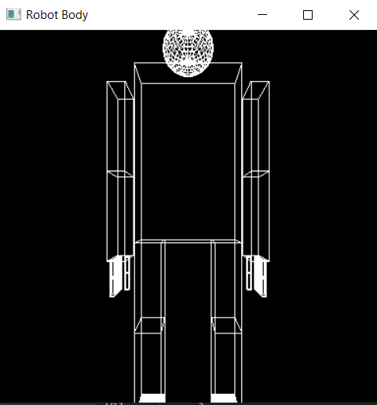
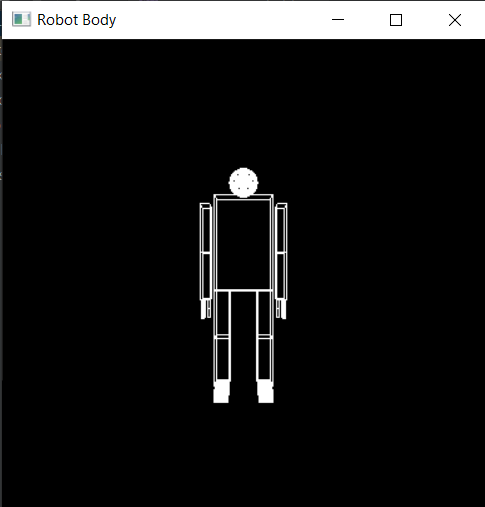
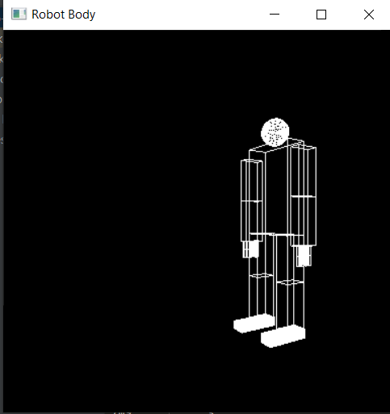
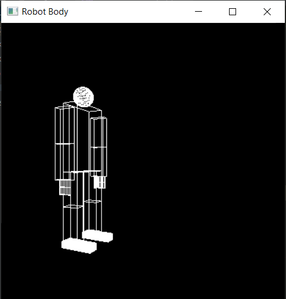
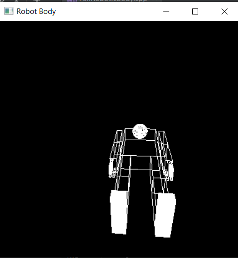
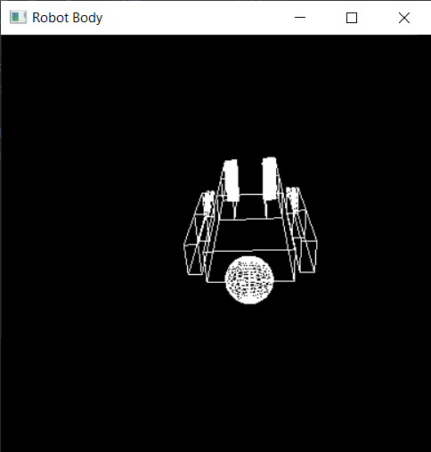

# Full-Scene-Animation

| Name                    | Section | Bench Number |
|-------------------------|---------|--------------|
| Ahmad Abdelmageed       | 1       |            8 |
| Ahmad Mahdy             | 1       |            9 |
| Remon Alber             | 1       |           31 |
| Salma Ayman Ahmed       | 1       |           37 |
| Abdullah Mohammed Sabry | 2       |            8 |

# Camera Movement Task

## Table of content
##### 1. Personal Information
##### 2. Task Objectives
##### 3. Description
##### 4. Usage (Keyboard Shortcuts)
##### 5. Results
##### 6. Issues

## Task Objectives
The main target of this task is to raise modelings transformation level, modeling a 3D object, apply transformations to move the camera around, up, beneath and through the objects the model and simulation for full body joints movement.

## Description
This task aims to make a transformations to move the camera around a full-body of a robot model by and control its movements using keyboard keys using OpenGL and GLUT.

## Usage (Keyboard Shortcuts)
Using the keyboard in upper or lower case, you could test the movement of the body.
* Moving Camera Right: '&rarr;'
* Moving Camera Left: '&larr;'
* Moving Camera Up: '&uarr;'
* Moving Camera Down: '&darr;'
* Moving Forward: `'1'`
* Moving Backward: `'2'`
* Moving the whole body: `'b'`
* Moving the left and right arm: `'r'` and `'q'`
* Moving the left and right elbow: `'f'` and `'a'`
* Moving the left and right leg: `'e'` and `'w'`
* Moving the left and right knee: `'d'` and `'s'`
* Moving the left fingers base, `'t'`, `'u'`, `'o'`, `'g'`, `'j'`.
* Moving the left fingers up, `'y'`, `'i'`, `'p'`, `'h'`, `'k'`.
* Moving the right fingers base, `'z'`, `'c'`, `'n'`, `'['`, `';'`.
* Moving the right fingers up, `'x'`, `'v'`, `'m'`, `']'`, `'/'`.

## Results
### 1. move-forward View

### 2. move-backward View

### 3. Right View

### 4. Left View

### 5. Up View

### 6. Down View

## Issues
The problem I faced was in the "direction" variable.