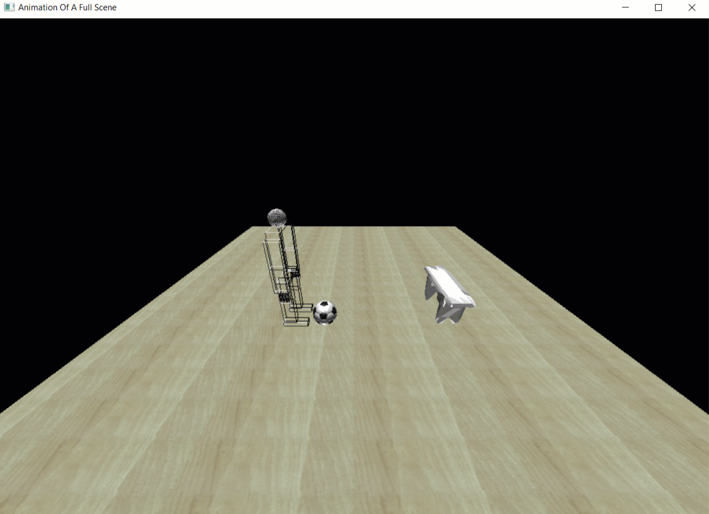

# Full-Scene-Animation

| Name                    | Section | B.N Number   | E-mail                        | Group ID |
|-------------------------|---------|--------------|-------------------------------|----------|
| Ahmad Abdelmageed Ahmad | 1       |            8 | ahmedmageed19@gmail.com       | xx       |
| Ahmad Mahdy Mohammed    | 1       |            9 | ahmadmahdy3098@gmail.com      | xx       |
| Remon Alber Fely        | 1       |           31 | remonalbear522@gmail.com      | xx       |
| Salma Ayman Ahmed       | 1       |           37 | soayman9@gmail.com            | xx       |
| Abdullah Mohammed Sabry | 2       |            8 | abdullah.m.alrefaey@gmail.com | xx       |

## Table of content
##### 1. Task Objectives
##### 2. Usage (Keyboard Shortcuts)
##### 3. Animations
##### 4. Texture Mapping 
##### 5. Objects
##### 6. Lighting & Color
##### 7. Issues
##### 8. Conclusion

## Task Objectives
The main target of this project is:
* Applying three different types of animations to a full-robotic body.
* Loading different external objects.
* Applying texture mapping to the floor with different options.
* Applying Lighting & Coloring concept
* Make an interaction between the robotic body and an object.

## Description
This project is about .....

## Basic Usage (Keyboard Shortcuts)
Using the keyboard in upper or lower case, you could test the movement of the body and its animation.
1. Animations:
    * Walking Forward : `'d'`
    * Walking Backward :`'a'`
    * Jumping :`'space'`
    * Jumping Over :`'l'`
    * Kick :`'k'`
2. Body Transformations:
    * Rotate the whole body: `'b'`
    * Moving the left and right shoulder aside: `'y'` and `'r'`
    * Moving the left and right shoulder forward: `'u'` and `'t'`
    * Moving the left and right elbow: `'h'` and `'f'`
    * Moving the left and right leg: `'z'` and `'g'`
    * Moving the left and right knee: `'x'` and `'v'`
3. Camera Movements:    
    * Right: '&rarr;'
    * Left: '&larr;'
    * Up: '&uarr;'
    * Down: '&darr;'
    * Zoom In: `'+'`
    * Zoom Out: `'-'`

## Animations
We applied three different types of animations to the whole scene. Some of the animations are related to the body without interacting with any external object and the others by interacting with an external objects such as the ball and table.

#### The idea of the animation
The basic idea of applying an animation to a robotic body or to any object is to change its state or its position in different steps and swapping the buffer in each frame rapidly. This will make the scene looks like it's animating.

#### Types of animations
- Walking forward
- Walking backward
- Jumping
- Jumping Forward
- Kicking a ball on the ground or above a table

Now lets talk about each type and see how it looks in the following GIFs.
### 1. Walking Forward
To apply this animation, three joints is rotated (hip, knee, shoulder) with increasing the coordinates of the body in the same direction he wants to move along. Also this movement is limited by the dimensions of the ground so the robot can't walk outside the floor.

### 2. Walking Backward
The same concept as walking forward but the joints rotates in the opposite direction as well as the coordinates of the body decreases in the opposite direction.

### 3.Jumping
As shown on the gif three joints (knee, elbow and shoulder) are rotated while jumping and the coordinates of the body is changing and return to the original state.

### 4. Jump Forward
This animation is made by mixing between the jumping and moving forward animations.

### 5. Kicking a ball
This type of animation has 2 cases, one without interacting with the table and the other by interacting with it.

##### Case #1: Kicking the ball on the ground
This is applied by moving the right leg backward then forward and after it reaches the ball, the ball is kicked as shown in the GIF. As you see the distance between the ball and the table is too large, so the ball will fall on the ground.

##### Case #2: Kicking the ball on the table
This is the same animation as above exactly but here the ball is close to the table, so after kicking it, the ball will fall on the table.

## Texture Mapping
We apply three different textures, and we change between them using a menu binned to the right mouse button.

## Loading External Objects
As shown from the previous GIFs we upload two different objects.  

## Lighting

## Issues

## Conclusion
